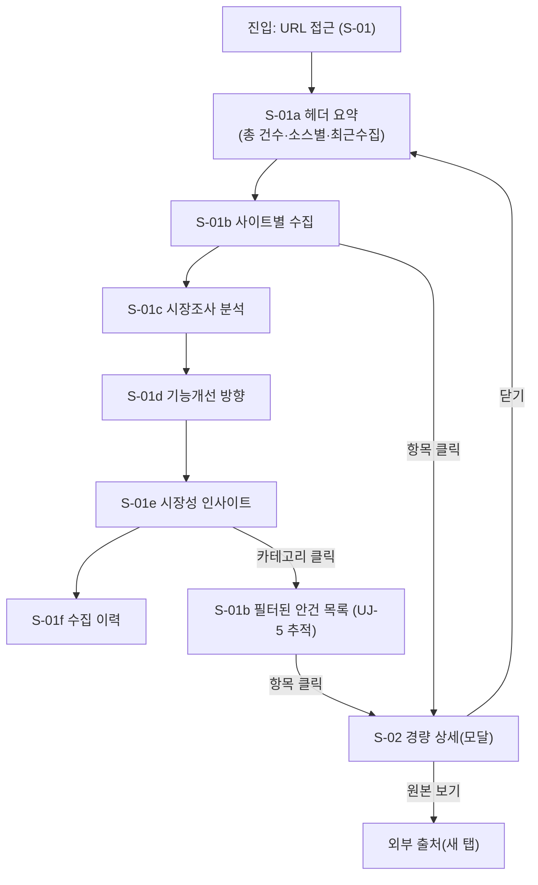

# 스토리보드 (storyboard.md) — 시장조사·분석 대시보드

- **작성팀**: 디자인팀 (design-team)
- **모드**: standard (6단계 — 디자인)
- **기준**: `plan.md`(FR-05~11, AC-05~11), `userflow.md`(UJ-1~5), `test-design.md`(AC→TC 매핑)
- **산출물**: storyboard.md / design-system.md / design-review.md (+ 각 .html)
- **사용 스킬 로그**: `sequences`(여정별 화면 전환 시퀀스 프레임), `prototype`(와이어프레임·상태 설계), `design-system`(토큰/컴포넌트 규칙 정리), `md-to-html`(.html 생성). *design-system·접근성 세부는 design-system.md에서 규정한다.*

---

## 0. 설계 방향 (요약)

- **제품**: 위시켓·프리모아(도급), u300 모두의창업(현재·1기), Devpost(해커톤) 안건을 크롤링·표준화 저장한 **단일 페이지 스크롤 대시보드**.
- **핵심 경험**: 로그인 없이 URL로 접근해, 스크롤 한 번으로 "지금 시장에서 어느 영역이 유망한가"를 5~10초 안에 파악.
- **페이지 구조(6섹션, 고정 순서)**: `헤더 요약 → 사이트별 수집 → 시장조사 분석 → 기능개선 방향 → 시장성 인사이트 → 수집 이력`.
- **동반 규칙**: 빈·에러·로딩 상태 명확 구분, 저신뢰 수치 신뢰 뱃지, 반응형(모바일/데스크톱)·다크모드, 외부 CDN 금지(차트 번들 내장), 키보드 내비게이션.

---

## 1. 정보 구조 (IA) & 페이지 목록

### 1.1 페이지 목록
> 단일 페이지(Single Page Application) + 경량 상세(모달/오버레이). 외부 이동은 "원본 보기" 링크(새 탭).

| 화면 ID | 화면명 | 유형 | 근거 여정 | 관련 AC |
|---|---|---|---|---|
| S-01 | **대시보드 (단일 스크롤 페이지)** | 페이지 | UJ-1~4 | AC-09-1, AC-09-2, AC-11 |
| S-01a | 헤더 요약 섹션 | 섹션 | UJ-1 | AC-09-1, AC-11-1 |
| S-01b | 사이트별 수집 섹션 | 섹션 | UJ-2, UJ-5 | AC-05-1 |
| S-01c | 시장조사 분석 섹션 | 섹션 | UJ-3 | AC-06-1~5 |
| S-01d | 기능개선 방향 섹션 | 섹션 | UJ-4 | AC-07-1 |
| S-01e | 시장성 인사이트 섹션 | 섹션 | UJ-4, UJ-5 | AC-08-1, AC-08-2 |
| S-01f | 수집 이력 섹션 | 섹션 | UJ-1 | AC-11-1, AC-11-2 |
| S-02 | **안건 경량 상세 (모달)** | 오버레이 | UJ-2, UJ-5 | AC-05-2, AC-10-1, AC-10-2(S) |
| S-03 | **전역 상태** (로딩 / 에러 / 빈 상태) | 상태 | 전 여정 | AC-09-1(빈/에러), AC-06-5, AC-07-1, AC-08-1 |

### 1.2 정보 구조 트리
```
market-dashboard (S-01)
├── ① 헤더 요약 카드 (S-01a)
│     ├── 총 수집 건수 · 소스별 건수(위시켓/프리모아/u300/Devpost)
│     ├── 최근 수집 시각 · 수집 상태 뱃지
│     └── (퀵) 섹션 앵커 내비게이션
├── ② 사이트별 수집 (S-01b)
│     ├── 소스 탭/필터 (위시켓·프리모아·u300·Devpost·전체)
│     ├── 안건 목록 (제목·예산·기간·카테고리·등록일)
│     ├── 검색 · 페이징
│     └── 항목 → S-02 경량 상세
├── ③ 시장조사 분석 (S-01c)
│     ├── 카테고리 수요 점유율 (도넛/바 차트)
│     ├── 예산 분포 (히스토그램) · 기간 분포
│     ├── 상주 vs 도급 비중 (파이/도넛)
│     ├── 기술 키워드 랭킹 (바/태그 클라우드)
│     └── 월간 등록 추이 (라인/영역 차트)
├── ④ 기능개선 방향 (S-01d) — 후보 목록 + 근거(건수)
├── ⑤ 시장성 인사이트 (S-01e) — 카드/표 + 신뢰 뱃지 + 근거기간
└── ⑥ 수집 이력 (S-01f) — 최근 시각·소스별 건수·상태·실패
```
- 전역: 우상단 **다크모드 토글**, 좌상단 **로고/타이틀**, 하단 footer(데이터 출처·고지).

---

## 2. 여정별 화면 전환 맵 (UJ-1~5)

### 2.1 전환 맵 (Mermaid)


### 2.2 여정-화면 매핑 테이블
| 여정 | 목표 | 화면 | 핵심 요소 | 전환 |
|---|---|---|---|---|
| UJ-1 | 5초 안에 시장 요약 | S-01a → S-01f | 헤더 카드·소스별·수집이력 | 상→하 스크롤, 앵커 점프 |
| UJ-2 | 소스별 안건 탐색 | S-01b → S-02 | 필터·목록·검색·페이징·상세 | 탭 전환/항목 클릭 |
| UJ-3 | 시장 분석 수치 확인 | S-01c | 분석 차트 5종 | 스크롤/탭 |
| UJ-4 | 기능 방향·시장성 도출 | S-01d → S-01e | 후보 목록·인사이트 카드·신뢰 뱃지 | 스크롤 |
| UJ-5 | 데이터 신뢰 검증(드릴다운) | S-01e → S-01b → S-02 → 외부 | 카테고리→근거 안건→원본 | 클릭·새 탭 |

**핵심 추적 경로 (UJ-5)**: `인사이트 카드(카테고리 X) → [클릭] → S-01b에 source/category=X 자동 필터 → 안건 목록 → [항목 클릭] → S-02 경량 상세 → [원본 보기] → 출처 원문`. 이 경로로 "수치의 근거"를 원본에서 검증할 수 있어야 한다(SC-2 신뢰성).

---

## 3. 화면별 와이어프레임 (S-01 ~ S-03)

> 범례: `[ ]`=카드/컨테이너, `( )`=버튼·인터랙션, `▮`=차트 대체 영역, `…`=더보기. ASCII 와이어프레임 + 핵심요소/위치/규칙.

### S-01a — 헤더 요약 섹션
```
┌────────────────────────────────────────────────────────────┐
│ [로고] 시장조사·분석 대시보드        🌙(다크모드) (수집 실행) │  ← GNB
├────────────────────────────────────────────────────────────┤
│  지금 시장 요약   ·  [최근 수집: 2026-08-13 09:00 · 상태ⓘ]  │
│ ┌─────────────┐ ┌─────────────┐ ┌─────────────┐ ┌─────────┐ │
│ │  총 수집 건  │ │ 위시켓 도급  │ │ 프리모아 도급│ │ u300 공모│ │ ← 요약 카드
│ │    66,000+  │ │   66,000+  │ │    23,000+ │ │  357+   │ │   [높음]
│ └─────────────┘ └─────────────┘ └─────────────┘ └─────────┘ │
│ ┌─────────┐ ┌─────────┐ ┌──────────────────────────────┐  │
│ │Devpost  │ │ 상주vs  │ │ [앵커: 사이트별|분석|기능|시장성] │  │
│ │ 24+해커톤│ │ 도급 ▮  │ │    (빠른 이동 내비게이션)       │  │
│ └─────────┘ └─────────┘ └──────────────────────────────┘  │
└────────────────────────────────────────────────────────────┘
```
- **요소/위치**: GNB(로고·다크모드·수집 실행) → 인사이트 한 줄(마케팅 문구 아님, 수치 중심) → 요약 카드 4×2 그리드(총/소스별/상주비중/Devpost).
- **규칙**: 카드 숫자는 큰 타입(디스플레이), "도급 기준" 단위 주석. 상태 뱃지는 성공(초록)/부분(주황)/실패(빨강).
- **빈 상태**: 수집 이력 없으면 카드에 "아직 수집되지 않음" 대체.

### S-01b — 사이트별 수집 섹션
```
┌────────────────────────────────────────────────────────────┐
│ [사이트별 수집]  (전체|위시켓|프리모아|u300|Devpost)  🔍검색 │
├────────────────────────────────────────────────────────────┤
│ [◀ 1 2 3 … ▶]  행당 표: 제목 | 예산 | 기간 | 카테고리 | 등록일 │
│ ┌────────────────────────────────────────────────────────┐│
│ │ B2B AI 구축 프로젝트   1,200만원  3개월  AI·데이터  08-03 ││ ← 목록행(클릭 가능)
│ │ 원본 보기 ↗   [신뢰: 높음]                              ││
│ └────────────────────────────────────────────────────────┘│
│ …                                                            │
│ (더 보기 / 페이지네이션)                                   │
└────────────────────────────────────────────────────────────┘
```
- **요소/위치**: 섹션 타이틀 → 소스 탭(전체 기본) → 검색(우측) → 테이블/카드 목록(좌→우: 제목·예산·기간·카테고리·등록일) → 각 행 "원본 보기 ↗" 링크 → 페이징 하단.
- **규칙**: 목록 밀도가 시장조사 차트와 혼재하지 않도록, 이 섹션만 별도 컨테이너. 행 hover 하이라이트, 클릭 시 S-02.
- **빈 상태**: 소스 0건 → "이 소스의 안건이 아직 없습니다" + (수집 실행) 버튼.
- **에러 상태**: API 실패 → 에러 배너 + (재시도).

### S-02 — 안건 경량 상세 (모달 오버레이)
```
┌─────────────────────────────────────┐
│  B2B AI 구축 프로젝트            (✕) │ ← 모달 헤더
│  ┌───────────────────────────────┐  │
│  │ 카테고리: AI·데이터 │ 유형: 도급 │  │ ← DB 필드 그리드
│  │ 예산: 1,200만원   │ 기간: 3개월 │  │    (null → "정보 없음")
│  │ 지역: 서울        │ 등록일: 08-03│ │
│  │ 기술키워드: LangChain, RAG     │  │
│  └───────────────────────────────┘  │
│  (원본 보기 ↗)  (닫기)              │ ← 행동
└─────────────────────────────────────┘
```
- **접근성**: 모달 열림 시 포커스 이동·`Esc` 닫기·배경 클릭 닫기·포커스 트랩.
- **빈 필드**: 필드값 없으면 "정보 없음" 회색 텍스트(AC-10-1).
- **원본 링크 실패**: 외부 삭제/변경 시 "(현재 해당 원본을 찾을 수 없음)" 안내(AC-05-2 edge).

### S-01c · S-01d · S-01e · S-01f — 하단 분석 섹션
```
┌────────────────────────────────────────────────────────────┐
│ [S-01c 시장조사 분석]  (전체|소스별)                         │
│ ┌────────────┐ ┌────────────┐ ┌────────────┐ ┌────────────┐│
│ │카테고리 점유 ▮│ │예산 분포 ▮  │ │기간 분포 ▮ │ │상주vs도급 ▮ ││ ← 차트 그리드
│ └────────────┘ └────────────┘ └────────────┘ └────────────┘│
│ ┌──────────────────────────┐ ┌──────────────────────────┐ │
│ │ 기술 키워드 랭킹 ▮          │ │ 월간 등록 추이 ▮            │ │
│ └──────────────────────────┘ └──────────────────────────┘ │
├────────────────────────────────────────────────────────────┤
│ [S-01d 기능개선 방향]  후보 1..N + 근거(건수) [근거 부족→분석 미실행]│
├────────────────────────────────────────────────────────────┤
│ [S-01e 시장성 인사이트]  카드: 카테고리명·건수·▲추이·근거기간│
│    [신뢰: 높음] [신뢰: 중간] [신뢰: 낮음] ← 신뢰 뱃지 필수      │
├────────────────────────────────────────────────────────────┤
│ [S-01f 수집 이력]  최근 시각·소스별 건수·상태  [실패: 건수/원인]│
└────────────────────────────────────────────────────────────┘
```
- **S-01c**: 분석 차트 5종을 그리드로, 각 차트 카드에 타이틀 + 데이터 범위·null 주석 표기. 소스/기간 필터 공유.
- **S-01d**: 기능개선 후보는 "수요 많고 공급 부족" 영역을 목록+근거(건수·추이)로. 근거 부족 시 "분석 미실행" 안내(단정 금지).
- **S-01e**: 인사이트 카드는 `카테고리명 · 추정 건수 · ▲증가율/추이 · 근거기간` + **신뢰 뱃지(높음/중간/낮음)** 필수. "~로 추정/공지" 표현, 절대 확정 수치·단정 금지(AC-08-1).
- **S-01f**: 수집 이력 테이블(시각·소스·건수·상태). 부분 실패 시 실패 건수·원인("원인 미상" 허용). 이력 없으면 "아직 수집 없음".

### S-03 — 전역 상태 (로딩 / 에러 / 빈 상태)
```
[로딩]   ▸ 스켈레톤/스피너 + "데이터를 불러오는 중…" (섹션별 독립 로딩)
[에러]   ▸ [⚠ 오류] "데이터를 불러오지 못했습니다" + (재시도) + (자세히: 원인)
[빈 상태] ▸ [🗂] "아직 수집되지 않음 / 분석 미실행 / 데이터 없음" + (안내 문구)
```
- 로딩은 전역 로더가 아닌 **섹션별 스켈레톤**(다른 섹션은 즉시 보임).
- 에러는 재시도 가능하게, 원인 표시(TC-34 원인 미상 허용).
- 빈 상태는 "없음"의 원인(미수집/미분석/검색결과 없음)을 구분해 안내.

---

## 4. 인터랙션 & 상태 정의

### 4.1 주요 인터랙션
| 요소 | 인터랙션 | 피드백 |
|---|---|---|
| 소스 탭 | 클릭 → 목록/차트 필터 | 활성 탭 하이라이트, 콘텐츠 갱신 |
| 안건 행 | hover → 배경 강조 / 클릭 → S-02 | hover: 캐럿, row highlight |
| 원본 보기 | 새 탭 오픈 | 아이콘 ↗, 새 탭 안내 |
| 다크모드 토글 | 클릭 → theme 전환 | 즉시 전환, localStorage 저장 |
| 차트 카테고리 | 클릭 → S-01b 필터(추적, UJ-5) | 필터 반영 + 스크롤 이동 |
| 인사이트 카드 | 클릭 → 근거 안건 목록 연동 | S-01b 필터 + 하이라이트 |
| 수집 실행 | GNB 버튼 → 배치 트리거 | 진행 로딩 → 완료 토스트 |
| 앵커 내비게이션 | 클릭 → 해당 섹션 스크롤 | 부드러운 스크롤, 섹션 강조 |
| 검색/페이징 | 입력/클릭 | 목록 갱신, 결과 건수 표시 |

### 4.2 상태 매트릭스 (로딩/에러/빈)
| 화면/컴포넌트 | 로딩 | 에러 | 빈 | 정상 |
|---|---|---|---|---|
| 헤더 요약 (S-01a) | 스켈레톤 카드 | 에러 배너+재시도 | "아직 수집되지 않음" | 숫자·상태 뱃지 |
| 소스 목록 (S-01b) | 스켈레톤 행 | 에러 배너+재시도 | "0건 안내"+(수집 실행) | 목록·페이징 |
| 분석 차트 (S-01c) | 스켈레톤 차트 | 차트 카드 에러 | "분석 미실행" | 차트+null주석 |
| 기능방향 (S-01d) | 로딩 | 에러 | "분석 미실행" | 후보+근거 |
| 시장성 (S-01e) | 로딩 | 에러 | "분석 미실행" | 카드+신뢰뱃지 |
| 수집이력 (S-01f) | 로딩 | 에러 | "아직 수집 없음" | 이력 테이블+실패 |
| 상세 모달 (S-02) | 스켈레톤 | 에러+재시도 | "정보 없음" 필드 | DB 필드+원본링크 |

---

## 5. 화면별 수용 기준(AC) 매핑

| 화면/컴포넌트 | 매핑 AC | 근거 |
|---|---|---|
| S-01 (전체 단일 페이지 6섹션) | AC-09-1 | 헤더→소스→분석→기능→시장성→이력 한 화면 |
| S-01 (반응형·차트) | AC-09-2 | 모바일/데스크톱 반응형, 짧은 데이터도 깨짐 없음 |
| S-01a 헤더 요약 | AC-09-1, AC-11-1 | 총건수·소스별·최근수집·상태 |
| S-01b 소스별 목록 | AC-05-1 | 필터·목록·원본URL·건수·페이징·빈상태 |
| S-02 경량 상세 | AC-05-2, AC-10-1 | DB필드 상세 + "원본 보기" + null="정보 없음" |
| S-01c 카테고리 점유율 | AC-06-1 | 카테고리별 건수·점유율, "기타" 집계 |
| S-01c 예산/기간 분포 | AC-06-2 | 히스토그램, null 제외+카운트 표기 |
| S-01c 상주vs도급 | AC-06-3 | 비중 차트, 값없으면 "기타" |
| S-01c 키워드 랭킹 | AC-06-4 | 상위 키워드·월간 변화, 없으면 공백 |
| S-01c 월간 추이 | AC-06-5 | 월별 시계열, 부족 시 안내 |
| S-01d 기능개선 방향 | AC-07-1 | 후보+근거(건수), 부족 시 "분석 미실행" |
| S-01e 시장성 인사이트 | AC-08-1, AC-08-2 | 성장 카테고리·근거·신뢰뱃지·단정 금지·추이 미확인 |
| S-01f 수집 이력 | AC-11-1, AC-11-2 | 시각·건수·상태, 실패/원인(미상 허용), 없으면 안내 |
| S-03 전역 상태 | AC-09-1(빈/에러), AC-06-5, AC-07-1, AC-08-1 | 로딩·에러·빈 상태 명확 구분 |
| S-02 원본 링크 실패 | AC-05-2(edge), TC-32 | 원본 삭제/변경 시 안내 |

> 전체 AC(AC-01~11)는 데이터·API 영역(테스트 TC-01~34)과 함께 `test-design.md`에서 E(End-to-End)로 검증하며, 본 storyboard는 화면 단위 기여분(AC-05~11 화면 요소)을 담당한다.

---

## 6. 반응형 & 다크모드 전략 (요약)

- **반응형**: 데스크톱(≥1024)은 4열 차트 그리드·테이블 목록, 태블릿(768~1023) 2열, 모바일(≤767) 1열 카드형 목록·세로 카드 차트.
- **모바일(≤767px) 5종 차트(C3)**: 가로 스크롤 금지. 상단 4개 차트(카테고리·예산/기간·상주·키워드)는 세로 1열 카드 기본, 과다 시 **탭형 뷰**(`[점유율|예산·기간|상주·키워드]`) 전환(탭=좌우 화살표 키 탐색·포커스 유지). 하단 '월간 등록 추이'는 탭 밖 고정 카드. 차트 키보드 스킴(`tabindex`범례·툴팁·대체 테이블)은 design-system §3.3·§6.2 준수(C4).
- **다크모드**: 디자인 토큰(`--bg`,`--surface`,`--text` 등 CSS 변수)으로 light/dark 전환, `localStorage` 저장 + OS 선호 감지. 차트·신뢰 뱃지 색도 토큰 기반.
- **외부 CDN 금지**: 차트·아이콘 번들은 빌드 시 번들링/내장(standalone HTML 산출).
- 세부 색·타이포·간격·접근성 규칙은 **design-system.md**에서 확정.

---
*끝 — 화면 단위 설계는 design-system.md의 토큰·컴포넌트 규칙을 따른다.*
